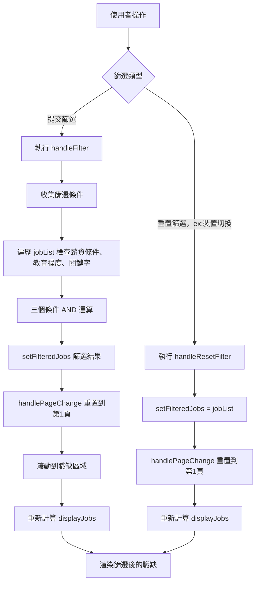
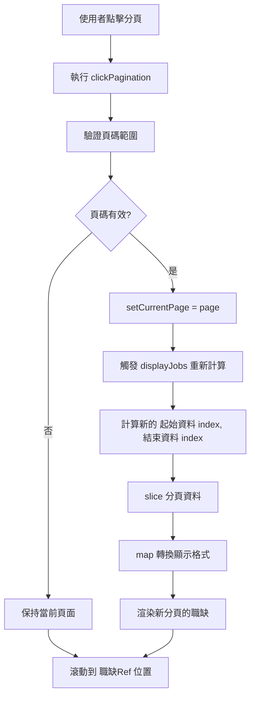
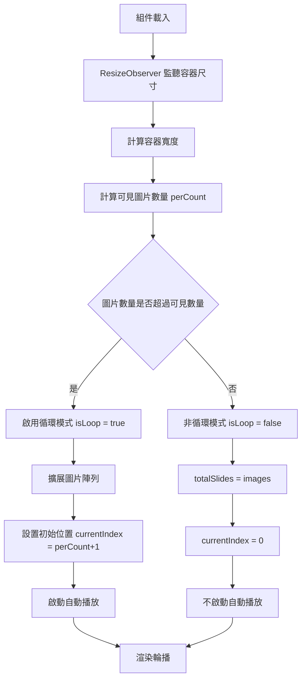
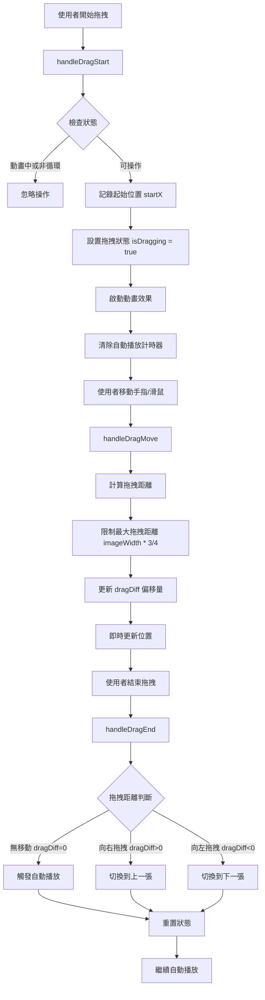

# Frontend Engineer Exam

專案連結：https://web-frontend-exam.pages.dev/

## 如何執行此專案

### 啟動專案

```
yarn install
yarn start
```

### 打包專案

```
yarn build
```

### 格式調整

```
yarn format
```

## 專案架構

### 主架構

```
web-frontend-exam/
├── public/
├── src/
│   ├── assets/                      ← 圖片放置位置
│   ├── components/
│   │   ├── Common/                  ← Common為共用模組放置位置
│   │   ├── JobSection/              ← JobSection為職缺模組放置，包含職缺單為以及職缺專屬模組放置位置
│   │   └── Kv/                      ← Kv為主視覺模組放置位置
│   ├── constants/
│   │   ├── educationList.js         ← 測試api用假資料
│   │   ├── jobList.js               ← 測試api用假資料
│   │   └── salaryList.js            ← 測試api用假資料
│   ├── styles/
│   │   ├── _shared.scss             ← 匯入共用樣式的入口位置
│   │   ├── _typography.scss         ← 字型樣式
│   │   ├── _variables.scss          ← 變數樣式（如顏色）
│   │   └── global.scss              ← 全域設定樣式（如reset)
│   ├── App.jsx
│   ├── index.js
│   └── theme.js                     ← mui套件會用的主題樣式調整
├── .eslintrc.js
├── .gitignore
├── .prettierrc
├── .yarnrc
├── deploy.sh
├── package.json
├── README.md
└── yarn.lock
```

### 模組展開架構

```
src/
└── components/
    ├── Common/
    │   ├── Carousel/
    │   │   ├── Carousel.jsx
    │   │   └── Carousel.module.scss
    │   ├── Icons/
    │   │   ├── BookIcon.jsx
    │   │   ├── PersonIcon.jsx
    │   │   └── SalaryIcon.jsx
    │   └── Pagination/
    │       ├── Pagination.jsx
    │       └── Pagination.module.scss
    ├── JobSection/
    │   ├── JobCard/
    │   │   ├── JobCard.jsx
    │   │   └── JobCard.module.scss
    │   ├── JobFilter/
    │   │   ├── JobFilter.jsx
    │   │   └── JobFilter.module.scss
    │   ├── JobModal/
    │   │   ├── JobModal.jsx
    │   │   └── JobModal.module.scss
    │   ├── JobSection.jsx
    │   └── JobSection.module.scss
    └── Kv/
        ├── Kv.jsx
        └── Kv.module.scss
```

## 邏輯說明

### 職缺

#### 主要組件架構

- **JobSection**: 主要容器組件，管理整體狀態和 API 呼叫
- **JobFilter**: 篩選組件（關鍵字搜尋、教育程度、薪資篩選）
- **JobCard**: 單一職缺卡片組件
- **JobModal**: 職缺詳細資料彈窗
- **Pagination**: 分頁控制組件

**職缺初始化**

1.  `JobSection` 組件在載入時會並行呼叫三個 API 來獲取必要的資料，包括職缺列表、教育程度選項和薪資選項
2.  儲存原始職缺資料 `jobList` 供後續使用
3.  更新篩選資料 `filteredJobs` 為原始資料（進入頁面時未進行篩選）
4.  將教育程度選項和薪資選項，建立對應的 Map 表供後續顯示時資料轉換使用
5.  將篩選資料 `filteredJobs`，依照所在分頁進行資料切割，並透過 Map 表轉換對應顯示文字後，更新 `displayJobs` ，渲染於職缺列表

**篩選處理**

1.  JobFilter 組件收集篩選條件：`keyword`、`education`、`salary`
2.  使用者點擊搜尋後，透過 `handleFilter` 函數處理篩選邏輯，並儲存篩選後的資料 `filteredJobs`
3.  當螢幕縮放至裝置類型不同時（以768px為分界點），透過 `handleResetFilter` 重置篩選項目，並更新篩選後的資料
4.  每次篩選異動後，都將重置到第一頁
5.  每次使用者主動進行篩選後，都將滾動至職缺頂部

```javascript
//篩選邏輯執行
const handleFilter = useCallback(
  filterData => {
    const result = jobList.filter(job => {
      const matchSalary = filterData.salary ? job.salaryId === filterData.salary : true
      const matchEdu = filterData.education ? job.educationId === filterData.education : true
      const matchKeyword = filterData.keyword ? job.companyName.includes(filterData.keyword) : true
      return matchSalary && matchEdu && matchKeyword
    })

    setFilteredJobs(result)
    handlePageChange(1) // 重置到第一頁
  },
  [jobList, handlePageChange]
)
```

```javascript
//重置篩選功能
const handleResetFilter = useCallback(() => {
  setFilteredJobs(jobList)
  handlePageChange(1)
}, [jobList])
```



**分頁邏輯流程**

1.  根據 `filteredJobs` 的職缺筆數，以及每頁顯示的卡片數量，計算分頁數
2.  裝置切換時，調整每頁顯示的卡片數量，重新計算分頁數（手機版：每頁 4 筆，桌面版：每頁 6 筆）
3.  裝置切換時，調整一次顯示的頁碼數量（手機版：6 個，桌面版：9 個）
4.  每次使用者主動點擊分頁時，都將滾動至職缺頂部
5.  判斷當前的頁數，顯示對應的頁碼（如下說明）

```javascript
// 計算前後可以顯示的頁碼數

const beforeCount = Math.floor(maxVisible / 2)
const afterCount = maxVisible - beforeCount - 1
// 初步推算顯示的起始頁與結束頁
let startPage = Math.max(1, currentPage - beforeCount)
let endPage = Math.min(totalPage, currentPage + afterCount)
```

```javascript
// 三種邊界情況的處理，調整起始頁與結束頁

if (totalPage <= maxVisible) {
  // 總頁數本身就小於等於可見頁碼數，從 1 開始
  startPage = 1
  endPage = totalPage
} else if (currentPage <= beforeCount) {
  // 當前頁在開頭區段（無法往前顯示）
  startPage = 1
  endPage = maxVisible
} else if (currentPage + afterCount >= totalPage) {
  // 當前頁在尾端區段（無法往後顯示）
  endPage = totalPage
  startPage = totalPage - maxVisible + 1
}
```



### 輪播

圖片輪播組件，支援自動播放、拖拽操作、點擊切換，並具有無限循環效果。

#### 主要組件架構

- **Carousel**: 圖片輪播共用組件

**輪播資料初始化**

1. 取得輪播容器寬度，計算可容納的完整圖片數量 `perCount`（圖片寬度為參數傳入）
2. 根據圖片數量是否超過容器寬度，決定是輪播或一般顯示
3. 若為輪播，則頭尾複製 `perCount` + 1 張
4. 設定顯示的第一張卡片index `currentIndex`
5. 每次容器resize時，重新計算 `perCount` 與 `currentIndex`（ResizeObserver 防抖: 限制 100ms 內只執行一次重新計算）



**無限循環與自動輪播**

1.  輪播使用 `transition` 配合 `currentIndex` 計算當前位移距離
2.  每次位移結束時 `transitionEnd`，觸發函式 `handleNext`，控制下一次的位移
3.  函式 `handleNext` 會判斷邊界，並延遲`autoPlayInterval`（傳入的參數，表示輪播間隔)後，觸發下一次currentIndex的調整

```javascript
// 右邊界檢查
if (index === length - perCount.current - 1) {
  setIsCarouselTransition(false) // 取消輪播transition效果
  setCurrentIndex(perCount.current + 1)
}
// 左邊界檢查
if (index === perCount.current) {
  setIsCarouselTransition(false)
  setCurrentIndex(length - perCount.current - 2)
}
```

**拖拽功能**

1.  判斷手機 touch 事件，與滑鼠 mouse 事件
2.  開始點擊/觸控時，清除自動播放計時器
3.  記錄點擊/觸控開始位置，並同步更新移動距離，最大拖拽距離為圖片寬度的 3/4，防止拖拽過度影響使用者體驗，並渲染位移於畫面上
4.  放開點擊/觸控時，判斷向左或向右滑動，觸法 `handleNext` 切換到上/下一張圖片
5.  離開輪播範圍同樣視為放開點擊/觸控，行為如第4點



## 專案遇到的困難、問題及解決方法

第一次使用 React 框架進行實作（先前都是使用 vue ），因此對於框架語法、hook等還不是很熟悉，花了一些時間釐清規則，
目前採取的方式為撰寫功能時，同步閱讀官方文件是否有相對應的方法使用，完成後以AI輔助優化
